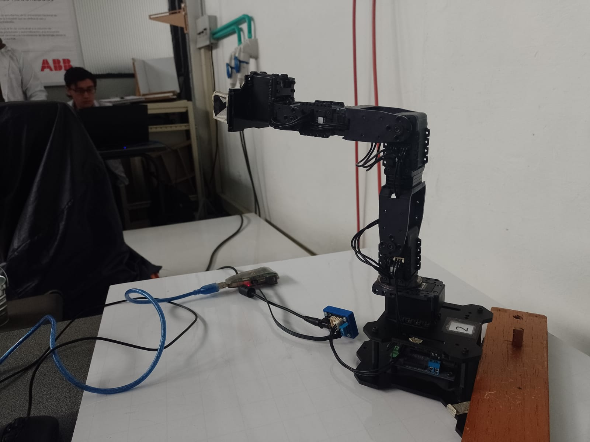
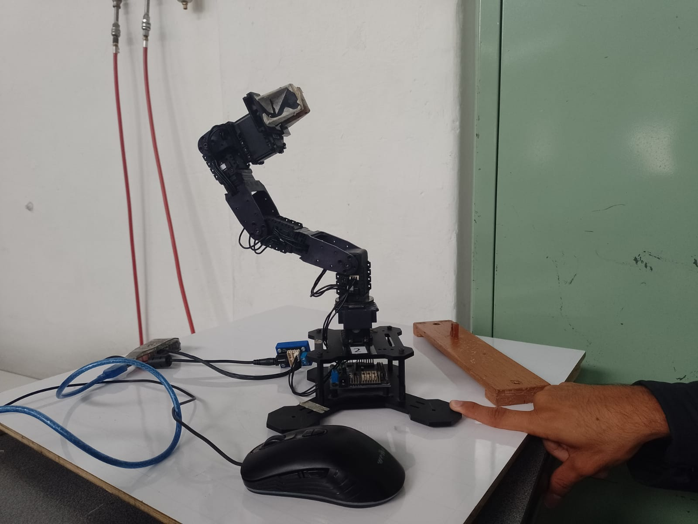
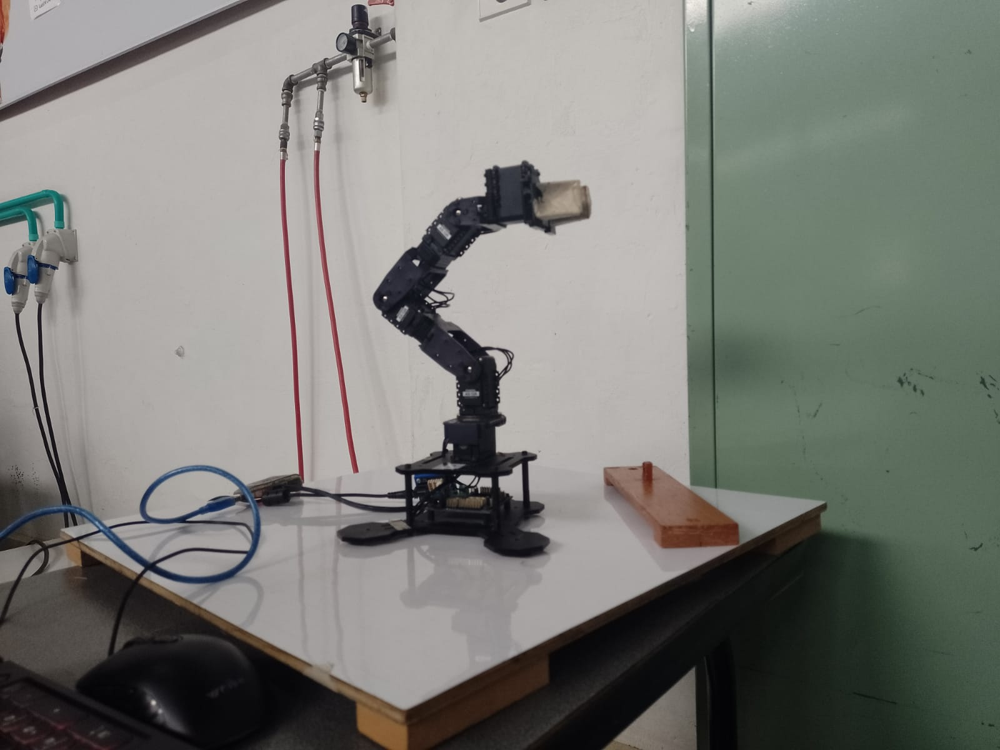
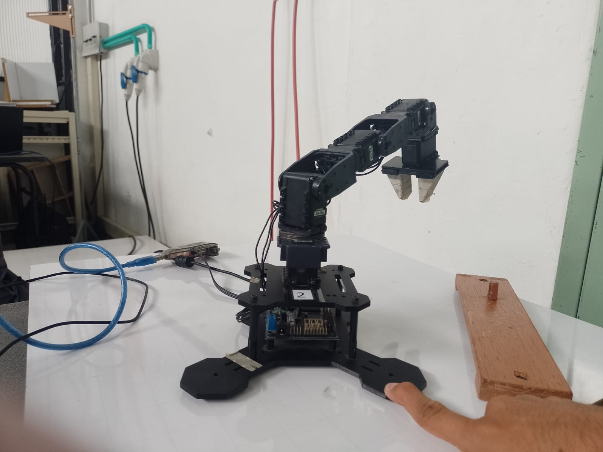

# Laboratorio 4 : Cinemática Directa - Phantom X - ROS
<p align="center">
 Cristhian David Sandoval Diaz
</p>
<p align="center">
 Dylan Ortiz Mayorga
</p>
<p align="center">
 Juan Pablo Vallejo Montañez
</p>

## 1. Introducción

El objetivo de esta práctica es implementar los Joint Controllers con ROS para manipular servomotores Dynamixel AX-12 del robot Phantom
X Pincher y usar tópicos de estado, servicios y comando para todos los Joint Controllers del robot Phantom X Pincher.


## 2. Metodología 

### 2.1 Caracterización del Robot Phantom X Pincher y definición de las poses deseadas.

Inicialmente se identifica la cadena cinemática del robot y se determinan la longitud de los eslabones que la componen.
Con las dimensiones de los eslabones establecidas se define la posición de home, y posteriormente se calcula la matriz Denavit-Hartenberg (DH) teninedo en cuenta los offsets para cada articulación. *Ver Figura 1.* 


<p align="center">
  
 </p>
<p align="center">
  <em>Figura 1 : Matriz de Denavit-Hartenberg para el robot Phantom x Pincher en su posición de home</em>
 </p>
 


Se definen las longitudes de los eslabones en milímetros *(mm)* con los siguientes valores :

- L1: 134.2
- L2: 105.2
- L3: 105.2
- L4: 67.5

Se realiza la verificación de la matriz  mediante el toolbox de Peter Corke en MATLAB para la posición de home implementando la siguiente sección de código:

```
L = [134.2 105.2 105.2 67.5];
off = [0 pi/2 -pi/2 0];

Ln1 = Link('revolute', 'd', L(1), 'a', 0, 'alpha', pi/2, 'offset', off(1));
Ln2 = Link('revolute', 'd', 0, 'a', L(2), 'alpha', 0, 'offset',   off(2));
Ln3 = Link('revolute', 'd', 0, 'a', L(3), 'alpha', 0, 'offset',   off(3));
Ln4 = Link('revolute', 'd', 0, 'a', L(4), 'alpha', 0, 'offset',   off(4));

Eslab = [Ln1;Ln2;Ln3;Ln4];
T_tool = eye(4);
Robot1 = SerialLink(Eslab, 'tool', T_tool)

```


Finalmente se establecen  5 poses deseadas del robot, donde la primera corresponde a la posición de home y las restantes se establecen aleaoteareamente.

Para definir los ángulos de las articualaciones de las poses restantes se toman respecto a los valores de cada una de las 4 articulaciones en la posición de home. Para la quinta articulación (asociada al movimiento del gripper) se definen valores arbitrarios. Los valores de las articulaciones para cada pose se registran en la *Figura 2*


<p align="center">
  
 </p>
<p align="center">
  <em>Figura 2 : Posición de Home </em>
 </p>
 
 <p align="center">
  
 </p>
<p align="center">
  <em>Figura 2 : Pose N°2 </em>
 </p>
 
 <p align="center">
  
 </p>
<p align="center">
  <em>Figura 2 : Pose N°3 </em>
 </p>
 
 <p align="center">
  
 </p>
<p align="center">
  <em>Figura 2 : Pose N°4 </em>
 </p>

<p align="center">
  
 </p>
<p align="center">
  <em>Figura 2 : Pose N°5 </em>
 </p>


FIGURA 2

Se usa nuevamente MATLAB para visualizar las poses definidas anteoriormente. Se inicializan los valores de las articulaciones *q* para cada una de las poses.


```
q1 = [0 0 0 0]*pi/180;
q2 = [40 23 42 40]*pi/180;
q3 = [72 -72 125 92]*pi/180;
q4 = [-88 48 -10 -43]*pi/180;
q5 = [-41 -69 86 -97]*pi/180;
```

 Se dibujan las poses por medio de la siguiente sección de código :
 
 ```
figure()
ws = [-300 300 -300 300 -50 500];
Robot1.plot ([0 0 0 0], 'workspace', ws, 'noa','noname')
hold on
trplot (eye(4), 'witdh', 2, 'arrow', 'length', 30)
Robot1.teach(q5) %% Usar el q que se desea de entre las opciones
hold off

```
Usando el comando *robot1.teach* se puede cambiar entre una y otra pose. 
Acontinuación se presentan las poses ordenadas desde la pose de home (1) hasta la pose N° 5. 


FIGURA DE LAS POSES


### 2.2 Instalaciones Previas en Ubuntu

Se realiza la instalación de *Dynamizel Wizard* y se descargan los paquetes y librerias necesarios para el manejo de los servomotores.

LINKS

Primero se conecta el pincher y se verifica que el sistema identifique los 5 servomotores usando el siguiente comando:

```
sudo chmod 777 /dev/ttyUSB0
```

Luego de  la identificación de los motores de acuerdo a las configuraciones respectivas en Dynamixel *(usando la opción Scan)*, se  desconecta  y se debe identificar el puerto USB al que pertenece el pincher, por lo general es el USB0, pero se verifica con el siguiente comando.

```
ls /dev/tty*
```

Una vez se tiene identificado el puerto USB,  se crea el espacio de trabajo **catkin**, donde en una carpeta creada llamad **“src”**,  se clona el git del dynamixel one motor.

```
git clone https://github.com/fegonzalez7/dynamixel_one_motor.git
```


Una vez descargado el **dynamixel one motor**, se ubica en una carpeta  catkin workspace, en el cual ubicamos en una carpeta creada y llamada “src”, una vez estando ahí, se hace el catkin_make para crear y establecer el espacio de trabajo, una vez dentro, nos interesa modificar 2 archivos dentro del one motor, el primero es el “basic.yaml” dentro del config, el cual establece el número de articulaciones el robot, este número de articulaciones es el que posee el pincher, es decir, 5 articulaciones, las cuales denominamos respectivamente con su ID, de la siguiente forma:


```
joint_1:
  ID: 1
  Return_Delay_Time: 0
  # CW_Angle_Limit: 0
  # CCW_Angle_Limit: 2047
  # Moving_Speed: 512


joint_2:
  ID: 2
  Return_Delay_Time: 0
 
joint_3:
  ID: 3
  Return_Delay_Time: 0
 
joint_4:
  ID: 4
  Return_Delay_Time: 0
 
joint_5:
  ID: 5
  Return_Delay_Time: 0
```

Después de esto, se salvan los cambios. En  la carpeta **“scripts”** hay 3 archivos los cuales se  eliminan y se guardan los siguientes archivos nuevos.
- Archivo python lab4.py : Archivo de codigo donde estara toda la información de movimiento, análisis, lectura de datos y transmisión de datos entre las articulaciones.
- Archivo HMI  : Contiene la interfaz gráfica para el usuario,
- Archivos de imagen necesarios para la implementación de la *Interfaz Humano Maquina*.

Con esos cambios en el dynamixel one motor se puede da incio a la ejecuación del laboratorio.
Se realiza el  launcher del dynamixel one motor.

```
roslaunch dynamixel_one_motor one_controller.launch
```

Una vez ejecutado este comando, funcionará correctamente con las siguientes condiciones, primero se debió haber llamado el setup.bash en el workspace.
```
source devel/setup.bash
```
Luego, cuando se ejecute, debe estar desconectado el dynamixel. Y por último se observará que ejecutando, se visualizaran las 5 articulaciones con sus  ID’s como se indicó anteriormente.

### 2.3 Implementación en Python 

Se importan los recursos necesarios y se establecen los valores de los torques límites para los servomotores. Es importante no asignar un valor tan alto para evitar sobrecargar a los servomotores, sin embargo este valor tampoco debe ser tan bajo como par no soportar el peso y movimientos que se desee. (posteriormente se verá su implementación con la función jointcommand -- PONER O CAMBIAR).

Además se establecen los valores de los ángulos en grados como se mostró en la *Figura 2* y se convierten a una escala de valores análogos (0 a 1023) con los que Dynamixel trabajará.

Luego de esto se crea la variable de pose real, la cual será dinámica y corresponderá a la que se entregue como ángulo real.

#### 2.3.1 Funciones implementadas en el script de Python.

##### a) Movimiento de articulaciones

```
def jointCommand(command, id_num, addr_name, value, time):
    rospy.wait_for_service('dynamixel_workbench/dynamixel_command')
    try:        
        dynamixel_command = rospy.ServiceProxy('/dynamixel_workbench/dynamixel_command', DynamixelCommand)
        result = dynamixel_command(command,id_num,addr_name,value)
        rospy.sleep(time)
        return result.comm_result
    except rospy.ServiceException as exc:
        print(exc)
 ```

Función obtenida de las librerías de dynamixel, usa los servicios de **dynamixel command** para mover las articulaciones, dando un ID, el comando que sea el de mover la articulación y un valor objetivo al cual llegar en un tiempo determinado, por medio del addr_name de “Goal_Position“ se consigue mover la articulación, de igual manera con este comando se le otorga un límite al torque de las articulaciones, por medio del comando “Torque_Limit” . Esta es la principal función para cambiar la posición de los motores del pincher y recibe los valores análogos.

#### b) Lectura de información.

 ```
def callback(data):
    global realPose
    realPose=np.multiply(data.position,180/pi)
    realPose[2]=realPose[2]-90
def listener():
    rospy.init_node('joint_listener', anonymous=True)
    rospy.Subscriber("/dynamixel_workbench/joint_states", JointState,callback)
 ```

Por medio de estas 2 funciones, se realiza un *subscribe* para leer la información por parte de las articulaciones. Se guarda en la *pose real*, se convierten los ángulos a grados y se corrige el offset de 90 grados en la segunda articulación, para tener una correcta lectura de datos por parte de los servomotores.

#### c) Muestra ángulos reales.

 ```
def printReal(real):
    print('\nÁngulos reales:\n')
    for i in range (len(real)):
        print(f'{str(i + 1)}: ' + "%.2f" % real[i] +'\n' )
  ```

Se imprime en terminal cada uno de los 5 ángulos reales que poseen las articulaciones.

#### d) Función de movimiento.

 ```
def Moving(j,Goal,Actual):
    N=5
    delta=((Goal-Actual)/N)
    for i in range(N):
        jointCommand('', (j+1), 'Goal_Position', int(Actual+delta*(i+1)), 0.5)
        time.sleep(0.1)
  ```

Por medio de un número de pasos, se pasa desde un pose anterior a una nueva pose por medio de la primera función y el uso de Goal_Position, donde de acuerdo a un ID mencionado cada articulación posee 5 pasos para moverse a la posición deseada. ( CORREGIR REDACCION ACA)

#### e) Función Main

 ```
Main:
if __name__ == '__main__':
    try:
        #Activar el subscriber.
        listener()


        #Definir los límites de torque de los motores.
        for i in range(5):    
            jointCommand('', (i+1), 'Torque_Limit', Torq[i], 0)
           
        #Rutina para ir al home.
        for i in range(5):
            jointCommand('', (i+1), 'Goal_Position', Ana1[i], 1)
            #print('Moviento eslabon: '+str(i+1)+'\n')
            time.sleep(0.5)
       
        #Realizar la rutina de movimiento.
        for i in range(5):
            Moving((4-i),anaPose[4-i],Ana1[4-i])


        #Imprimir la posición deseada respecto a la teórica.
        printReal(realPose)
    except rospy.ROSInterruptException:
        pass


 ```
El main, construido a partir de las funciones anteriores, sigue las siguientes instrucciones.
- Primero llama al listener, es decir, se activa el subscriber para poder recibir información y tener lectura de datos.
- Se ajusta el límite de torque para cada una de las 5 articulaciones
- Para cualquier rutina :
 - Se dirigirá el Pincher a su posición de home desde la posición en donde se encuentre por medio del **JointCommand**.
 - Estando en home, cada articulación se moverá con la función *Moving* hasta el valor definido para la pose deseada. En esta instrucción, la secuencia de movimiento de los motores es descendente; es decir, primero se moverá la articulación 5 , y de ultima la articulacioón 1. La filosofía detras de esto es evitar choques entre el robot y la plataforma (tablero), por esto se busca ajustar desde el extrémo del robot hasta la base para que cuando haga los movimientos con mayor probabilidad de choque, no tenga riesgo el cuerpo del pincher. 
- Por último se imprimen los ángulos reales para que el usuario pueda observarlos.


#### f) HMI

De acuerdo a los objetivos de aprendizaje se desea implementar una interfaz gráfica HMI para que  el usuario no deba usar la terminal, sino que tenga un mejor entorno de comprensión e interacción con el sistema. 

Para esto se implementa un archivo externo de Python, el cual crea la interfaz y la conecta con el archivo python existente *lab4.py*.
Se  llama el archivo python, y se asigna una entrada (es decir, el valor de la pose que el usuario desea) y luego trae lo que está impreso en terminal para mostrarlo de manera gráfica. La librería usada para realizar esta HMI es **tkinter**, la cual establece una nueva ventana, la que se modifica. Las funciones de la HMI se explican acontinuación.

##### *i) Llamar el archivo python*

 ```
# Obtén la ruta absoluta del directorio actual
directorio_actual = os.path.dirname(os.path.abspath(__file__))


# Construye la ruta al archivo en la misma carpeta
ruta_otro_archivo = os.path.join(directorio_actual, 'lab4.py')


def ejecutar_otro_archivo(entrada):


    mostrar_imagen()


    # Ejecuta el otro archivo Python y obtén la salida
    proceso = subprocess.Popen(['python', ruta_otro_archivo, entrada], stdout=subprocess.PIPE)
    salida = proceso.communicate()[0].decode('utf-8')
   
    # Actualiza la salida en la interfaz gráfica
    texto_salida.delete(1.0, tk.END)
    texto_salida.insert(tk.END, salida)
  ```

Inicialmente se dirige a  la ubicación del archivo actual para poder al archivo *lab4.py* que está ubicado en la misma carpeta que este nuevo archivo python de HMI.
Además, es necesario que para poder pasar la información al otro archivo python, se encuentre una linea así:
entrada = int(sys.argv[1])
De esta manera lo que se mande posteriormente con un botón, llegará a esta variable entrada y se ubicará en *lab4.py*.

Igualmente se espera que de esta forma el HMI sea lo mayormente separable del archivo python para movimiento para poder configurar y manipular más fácilmente ambos entornos de programación.

##### *ii) Visualización de Imagenes*

  ```
def mostrar_imagen():
    numero = int(entry_numero.get())


    # Obtener el nombre del archivo de imagen según el número
    nombre_imagen = f"q{numero}.png"


    # Cargar la imagen
    imagen = tk.PhotoImage(file=nombre_imagen)


    # Mostrar la imagen
    imagen_label.config(image=imagen)
    imagen_label.image = imagen
 ```
En esta función, de acuerdo al número que se ingresa, muestra la imagen de la pose en cuestión.

##### *iii) Entorno de la ventana*
  ```
# Crear la ventana principal
ventana = tk.Tk()
ventana.title("LAB4")
ventana.geometry("900x600")


# Crear contenedor para la columna izquierda
contenedor_izquierdo = tk.Frame(ventana)
contenedor_izquierdo.pack(side=tk.LEFT, padx=10, pady=10)


# Crear contenedor para la columna central
contenedor_central = tk.Frame(ventana)
contenedor_central.pack(side=tk.LEFT, padx=10, pady=10)


# Crear contenedor para la columna derecha
contenedor_derecha = tk.Frame(ventana)
contenedor_derecha.pack(side=tk.LEFT, padx=10, pady=10)
  ```

Se crea la ventana de trabajo  la cual se divide en 3 frames, que son las subdivisiones en la cual se pondrá la información y los distintos elementos como imágenes o Labels.

En la columna de la izquierda se ubica el logo de la universidad, la información de los integrantes del grupo y un frame adicional que contiene la caja de entrada y su texto en donde el usuario pondrá el número de la pose que desea tener, ademas del boton el cual hará mover el robot y posteriormente colocar la imagen relacionada.

En el frame central se ubica la imagen que se tiene de acuerdo a la pose indicada, esta imagen se actualizará una vez se termine de mover el robot, de manera que toda la información, tanto imagen como datos de ángulos reales se muestra una vez terminado de mover el Phantom X.

Por último en el frame de la derecha se muestran los ángulos reales, donde se le posiciona un label y luego un espacio de texto, el cual reacciona con la función inicial de llamar a *lab4.py*, es decir, muestra  todo lo que *lab4.py* imprimió en terminal.

## 3.Ejecución y resultados.

Para empezar a realizar lo realizado, primero debemos correr ROS con el comando.

  ```
roscore
  ```
Luego, en una terminal diferente, y ubicado en el workspace del catkin, se corre el dynamixel one motor una vez desconectado del dynamixel y con el setup.bash ejecutado.

  ```
roslaunch dynamixel_one_motor one_controller.launch
  ```

Y por último se dirige a la carpeta scripts donde se ubica el archivo HMI, de manera que si nuestro archivo se llama “hmi.py” tenemos el siguiente comando.

  ```
python hmi.py
  ```
  
Se abrirá la nueva ventana donde se observa la HMI creada y donde el programa estará listo para mover el Phantom X dada la pose que le indique el usuario.


