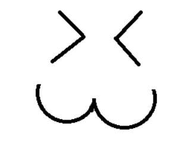

<h1> Laboratorio 5 
 
 Robótica de Desarrollo - Cinemática Inversa Phantom X

 Cristhian David Sandoval Diaz

 Dylan Ortiz Mayorga

 Juan Pablo Vallejo Montañez

## 1. Introducción

El objetivo de esta práctica es determinar el modelo cinemático inverso del robot Phantom X, generar trayectorias de trabajo para dibujar figuras con el robot y operarlo usando ROS a partir de scripts generados en Python.

## 2. Metodología 
 
### 2.1 Caracterización del robot.
 
### 2.2 Planteamiento del Problema
En este laboratorio se desea generar una rutina con el robot Phantom X la cual implemente las siguientes tareas : 
 
 - Cargar la herramienta.
 - Dibujar el espacio de trabajo.
 - Dibujar las inciales de los nombres de los integrantes del grupo *(CJD)*
 - Dibujar una figura de estilo libre.
 - Descargar la herramienta.

 A continuación, presentaremos un repaso rápido de en la generación de cada una de las subrutinas.
 
 #### *Cargar la herramienta*
 
 #### *Dibujo del espacio de trabajo*
 
 #### *Dibujo de las iniciales*
 
 

  
 

 
 

  <em>Figura 3 :Concepto incial de los puntos y trayectorias para el trazo de las letras </em>
 

 
 #### *Dibujo de figura en estilo libre*
 
  

  
 

 
 

  <em>Figura 4 :Concepto incial de los puntos y trayectorias para el trazo de la figura de estilo libre </em>
 

 
 #### *Descargar la herramienta*

## 3. Ejecución y resultados

https://docs.google.com/document/d/1IW1wlN8kBAo6353ksH-8YsHtTfJ6WyQPiX8TjBVO4R8/edit

Se incluyen evidencias del funcionamiento en [Video Laboratorio 5](https://www.youtube.com/watch?v=DuEC59lp24w)
