

<h1> Robótica
 
 Proyecto Final
 

 Cristhian David Sandoval Diaz

 Dylan Ortiz Mayorga

 Juan Pablo Vallejo Montañez

**

<h2>
 1.Descripción del Problema
</h2> 

El objetivo del proyecto es diseñar e implementar rutinas en el robot ABB IRB 140 con el fin de generar un proceso de *Pick & Place*.
De manera concisa, el proyecto consiste en realizar una rutina dividida en 3 partes: 
* **Movimiento del Balde :** El robot ABB IRB 140 sujeta un balde desde una banda transportadora con un gancho, y de ahí se transporta a un  punto de alistamiento.
* **Selección de piezas de la estanteria:** Se toman 4 de las 6 piezas ubicadas en la estanteria mediante una ventosa y se ddepositan en el balde en el punto de alistamiento.
* **Transporte Final:** Se sujeta el toma el balde con las 4 piezas y se lleva de regreso a la banda transportadora.

<h2>
 2.Diseño de la Herramienta
</h2>

El portaherramienta se diseñó para ser impresa en 3D con PLA, en este caso se planteó 3 piezas para imprimir debido a que la complejidad de la geometría se  dividio en 3 para  imprimirla de manera correcta. Se idearon 3 partes :
* Sección de anclaje al ABB
  

  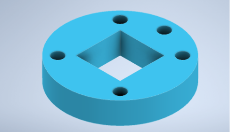
  

  

  <em>Figura 1 :Anclaje de la herramienta al Robot</em>
  

* Sujeción ventosa y ventosa
   

   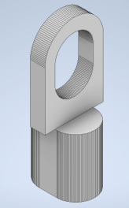
   

   

   <em>Figura 2 :Anclaje de la herramienta al Robot</em>
   

   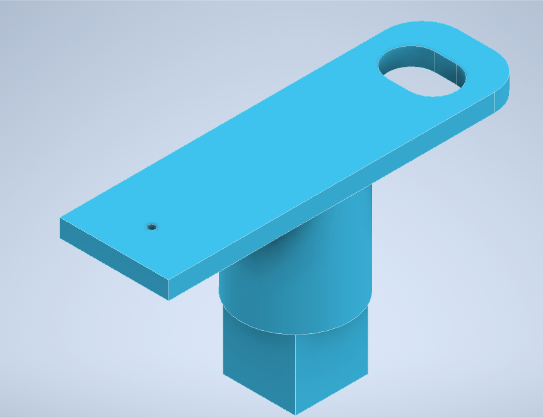
   

   

   <em>Figura 3 :Cuerpo de la herramienta</em>
   

 3.Diseño y modelado de elementos.
</h2>

Para realiazr la implementación de las rutinas en RobotStudio es necesario tener modelos de los elementos (herramientas,piezas, estanteruas) para incluirlos en el entorno de simulación. A continuación, se detalla el proceso de modelado de cada elemento.

<h3>
 3.1. Estanteria. 
</h3>

El estanteria implementada tiene las siguientes medidas.

  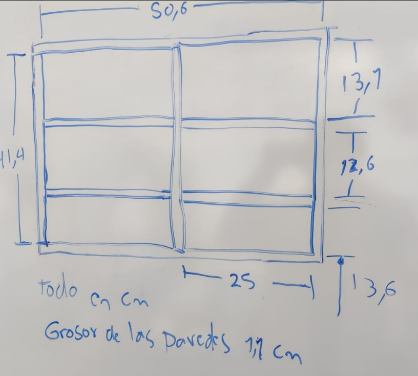
 

  <em>Figura 1: Medidas de la Estanteria</em>
 

La estanteria presenta una profundidad de 10 cm. Con estas mediadas se construye un modelado con el software Autodesk Inventor. 

  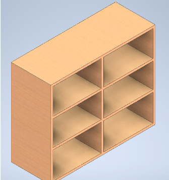
 

  <em>Figura 2: Modelado de la Estanteria</em>
 

INSERTAT IMAGEN PLANO ESTANTERIA 

<h3>
 3.2. Piezas. 
</h3>

La piezas corresponden a las geometrías que toma la ventosa para dejar en el balde. Estas figuras son arbitrarias y se 	realizan 6 modelos distintos.
La única restricción es su tamaño el cual debe ser meayor a la campana de succión de la ventosa para que se pueda sujetar completamente pero debe ingresar al balde sin esfuerzo por lo que hay un tamaño máximo para las piezas.

  

  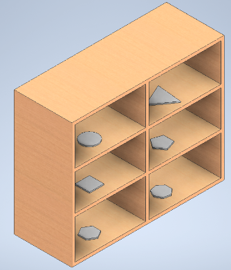
  

  

  <em>Figura 2: Disposición de las piezas de la estanteria</em>
  

<h3>
 3.3. Portaherramientas, balde y gancho. 
</h3>

El modelado de la herramienta se toma de su proceso de construccion descrito en la *Sección 2*.
Por otro lado, el modelado del gancho y del balde son incluidos dentro del planteamiento del proyecto.

*Modelado del Balde*
  

  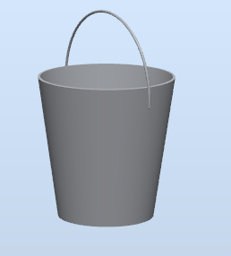
  

  

  <em>Figura 2: Modelado del Balde</em>
  

*Modelo del Gancho*
  

  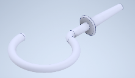
  

  

  <em>Figura 2: Modelado del Gancho</em>
  

<h3>
 3.4. Ventosa. 
</h3>

Esta herramienta fue incluida detro del plantemaineto del proyecto. A continuación se evidencia su modelado.

  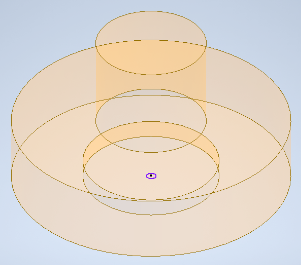
 

  <em>Figura 2: Modelado de la Ventosa</em>
 

  

  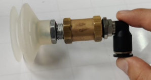
  

  

  <em>Figura 2: Ventosa implementada en las rutinas</em>
  

<h2>
 4.Sección de Alistamiento
</h2>

El punto de alistamiento es un punto intermedio donde se coloca el balde proveniente de la banda transportadora. Además, es el lugar donde la ventosa deposita las piezas tomadas de la estantería.

La ubicación seleccionada para el punto de alistamiento se encuentra en el punto medio entre la banda transportadora, ubicada a la derecha del robot, y la estantería, situada a la izquierda del robot. Desde la perspectiva del robot, el punto de aislamiento está en la parte frontal.

Es importante destacar que este punto se encuentra dentro de los límites articulares del robot, lo que significa que se espera que el robot pueda ejecutar los movimientos y rutinas solicitadas sin dificultades significativas.

Con el objetivo de asegurar un movimiento sencillo del robot y mantenerlo dentro de sus límites articulares, se ha diseñado cuidadosamente la ubicación y los procesos en el punto de alistamiento. Como se puede observar en la imagen, el robot no excede sus límites articulares, lo que facilita la ejecución de las acciones solicitadas.

  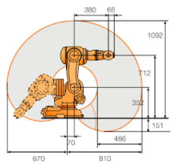
 

  <em>Figura 2:Limites Articualres del Robot</em>
 

<h2>
 5.Desarrollo e Implementación en RobotStudio
</h2>

Dentro del software RobotStudio se hace uso del robot ABB IRB 140 con su respectivo controlador, se importan los elementos modelados y se acomodan en el espacio de acuerdo a las medidas realizadas.

Para tener referencia física de los dispositivos que se implementan, se usará el robot 1 del LabSir, en el cual la banda transportadora se sitúa al  lado derecho del robot viéndolo desde su posición de home.

En el entorno de Home de  RobotStudio se generan 3  workobjects, asociados al balde en la banda transportadora, al punto de alistamiento y la estantería respectivamente.

A partir de lo anterior, se ajustan  los elementos en cada parte y se ordenan los modelados según sea el caso.
Para la estantería se realiza en un solo modelo incluyendo las piezas ubicadas en la estantería para mayor facilidad en su manejo. Referente al porta herramienta, se importa el modelo y se asigna como herramienta con la opción de Create tool, en este entorno se crea la herramienta y ahí mismo se ajustan los TCP de la misma, uno para el gancho y otro para la ventosa.En el caso del gancho, su TCP se estima en un punto del mismo donde se asegure que pueda tomar y dejar el balde sin problema. Una vez creada la herramienta se asocia al robot y esta queda configurada para su uso.

<h3>
 Lógica y Programación.
</h3>

La solución planteada para esta implementación consiste en construir 3 WorkObjects (balde, punto de aislamiento y  estantería) desde los cuales se definirán los targets con el fin de simplificar el uso de los mismos.

El origen de cada WorkObject se ubica de tal manera que el sistema se modele lo más cercano posible a la disposición real de los elementos en el laboratorio. 

Para la banda transportadora su origen se ubica en el punto de sujeción del balde y de igual forma para el punto de alistamiento.
Cada workobject tiene un estado estacionario, correspondiente a un target donde el robot se moverá de manera inicial y final, esto con el objetivo de facilitar las rutinas que lo involucran.

La creación de las caminos o path, se hacen en función de cada WorkObject .A continuación se hace una breve descripción del método o ruta de decisión para generar los paths de cada WorkObject. 
* **Balde en la banda transportadora :**  Se hace uso del TCP del gancho. De manera inicial, se hacen 2 caminos, uno para tomar el balde y otro para dejarlo; cada uno consta de 5 targets,en el caso de tomar el balde se generan tarjeta movimiento al punto de estado estacionario - aproximación por un costado al balde -  sujeción del balde - levantamiento el balde - retornar el balde al estado estacionario.
  De manera similar funciona el segundo path para dejar el balde, siguiendo el siguiente orden : levantamiento del balde -  movimiento de bajada del balde - descargue del balde - salida de la herramienta por un costado - retornar al estado estacionario.

* **Punto de aislamiento :** Consta de dos paths para posicionar el balde, y 1 para recoger el balde:
  * Primer Path Posicionar Balde : Aproximación al punto con baja velocidad  evitando oscilaciones producidas por la  inercia en el     balde. Este movimiento es de vital importancia para el correcto posicionamiento del balde y afecta de manera directa el correcto “place” de las piezas en el balde. Una vez cerca al punto de aislamiento este se queda en una posición elevada.
 
  * Segundo Path Posicionar Balde: Tras 3 segundos de espera, este path baja hasta el punto de aislamiento y se mueve por el lado del balde para volver a su respectivo punto estacionario
 
  * Path Recoger el Balde: Para tomar el balde posterior a dejar las piezas, cambia levemente, acercándose primero, pero esta vez no va hasta el balde sino que va más al fondo para asegurar que toma el balde, dado caso que la manija del mismo esta mal ubicada.

   Para estos paths se hace uso del gancho como herramienta.

* **Estantería:** Consta de 6 paths, uno para cada pieza, en este caso se cambia de TCP a la ventosa, adicionalmente posee 2 paths  
    adicionales para dejar la pieza en el balde
   * Path para Pieza n: Va al punto estacionario de la estantería, llega a un punto de aproximación de la pieza n, se posiciona encima de 
    la pieza y baja un poco para recogerla, luego se devuelve por estos target de aproximación para finalmente volver al punto 
    estacionario.
   * Path 1 para dejar la pieza: Tomada la pieza va al punto estacionario del workobject del punto de aislamiento, y se acerca al balde.
   * Path 2 para dejar la pieza: Tras desactivar el vacío con la electroválvula y que la pieza haya caído en el balde, el robot se aleja 
    del balde volviendo al punto estacionario de workobject de aislamiento.

  

  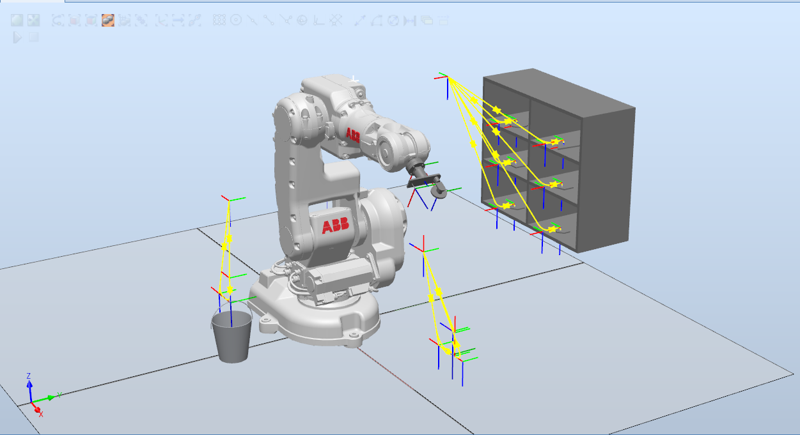
  

  

  <em>Figura 2: Implementación en RobotStudio</em>
  

<h2>
 6.Implementación en el brazo ABB IRB 140
</h2>

Con lo anterior establecido, sincronizamos con el entorno RAPID y procedemos a realizar el código que ejecutará el robot.

El ejercicio se resuelve en el orden de tener 4 entradas y 2 salidas, las 4 entradas corresponden a los 4 botones para cada rutina, las 2 salidas para el on y off de la electroválvula que prende y apaga el vacío de la ventosa, por lo que se crean en el entorno de simulación.

Esta electroválvula funciona con 2 debido a que con una señal empuja para activar y con otra diferente se desactiva, de manera que para cada señal, se debe energizar para que prenda la electroválvula y mantener ahí un poco para asegurar su funcionamiento, con 1 segundo es suficiente y luego de desenergiza para que de la libertad a la otra electroválvula de moverla y poder quitar y poner el vacío deseado.

Después de sincronizar se modifica el main en el orden deseado, empieza con un path de ir al home del robot de ahi sigue con el path de tomar el balde, y luego con los 2 paths de dejarlo con los 3 segundos intermedios, posteriormente se deja unos 3 segundos donde el operador debe seleccionar qué rutina tomar, y en este orden el programa decide cuál de las 4 opciones operar, cuando entra a una rutina, realiza el mismo proceso para cada una de las 4 fichas que toma.

Primero prende la electroválvula(salida 2 según código) para activar el vacío, de ahí hace el path donde va hasta la estantería, toma la ficha y vuelve al punto estacionario del workobject de la estantería, luego hace el path de soltar la ficha donde va hasta el balde, ubicado en el punto de aislamiento y cuando esta encima de él de acuerdo al path, se suelta la ficha, desactivando el vacío por medio de la otra electroválvula(salida 1 según código), para finalmente volver al punto.

<h2>
 7.Resultados
</h2>

Se realiza la validación del proceso con 2 rutinas de acuerdo a las indicaciones dadas sujetas a la demanda del robot, esta validación consta de dos videos los cuales se pueden evidenciar en el siguiente enlace::

Video: https://www.youtube.com/watch?v=FPRiDS6P5Rw

Los videos muestran inicialmente la simulación realizada en el RobotStudio para cada caso, así como la validación donde la rutina consiste en ir al home del robot, ir a tomar el balde, dejarlo en el punto de aislamiento para posteriormente con la ventosa y la activación y desactivación del vacío, tome las 4 piezas y las deje en el balde, de acuerdo a la rutina seleccionada de entre las 4 existentes, esta selección se realiza por medio de un botón. Una vez terminado el proceso, el robot toma nuevamente el balde y lo deja en la banda transportadora para finalmente volver a su posición de home.

<h2>
 8.Conlcusiones
</h2>
